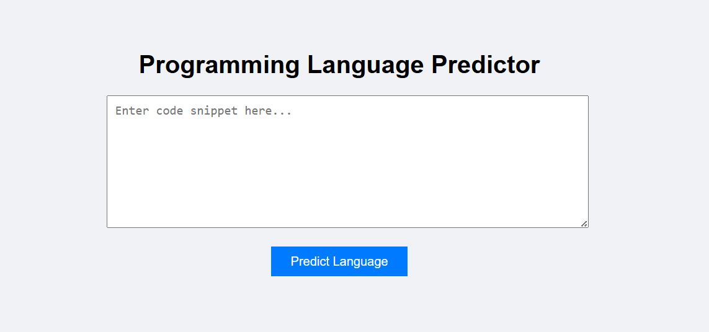

# Programming Language Predictor

This project predicts the programming language of a given code snippet using a Naive Bayes machine learning model.

## Features
- Predict programming language from code snippet
- Built using Flask web framework
- Machine learning model using Naive Bayes
- Simple web interface

## Technologies Used
- Python
- Scikit-learn
- Flask
- HTML
- CSS

## Supported Languages
- Python
- C
- Java
- JavaScript

## Project Structure
language_predictor/
│
├── app.py
├── programming.csv
├── model.pkl
├── vectorizer.pkl
│
├── templates/
│      index.html
│
└── static/
       style.css

## Screenshot

## How to Run
Install dependencies:
   pip install flask scikit-learn pandas
Run the app:
   python app.py
Open browser:
    http://127.0.0.1:5000
